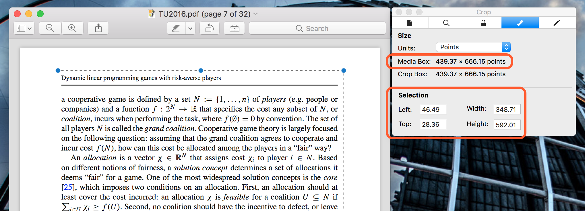

# pdftrim2up 

A quick-and-dirty script to trim and 2-up PDF files onto US Letter paper in landscape orientation.

## Installation

`pdftrim2up` is still a work in progress and __not__ on PyPI. You can install it like this:

```bash
pip install https://github.com/nelsonuhan/pdftrim2up 
```

## Compatibility

Tested on macOS 10.12, Python 3.5.2. 

## Usage

```
usage: pdftrim2up [-h] --odd ORIGINAL_WIDTH ORIGINAL_HEIGHT LEFT WIDTH TOP HEIGHT 
                       --even ORIGINAL_WIDTH ORIGINAL_HEIGHT LEFT WIDTH TOP HEIGHT
                       FILE
```

These instructions use Preview.app for macOS to obtain the necessary trimming measurements. You may be able to get similar measurements in other PDF viewers.

1. Open the document you want to `pdftrim2up` in Preview.app. Make sure the Inspector is shown (<key>&#8984;</key>-<key>I</key> or __Tools > Show Inspector__). 

2. Move to an odd page of your document. Use the __Rectangular Selection__ tool to select the region of the page you want to keep. Note (i) the measurements of your selection and (ii) the page width and height in the Inspector. (The page width and height are the __Media Box__ measurements.)



3. If the odd and even pages in your document are laid out differently, repeat Step 2 for an even page. Otherwise, you can use the same measurements for both odd and even pages.

4. Use these measurements as inputs to `pdftrim2up`. Using the example above, rounding the measurements:

```
pdftrim2up --odd 439 667 46 349 28 592 --even 439 667 46 349 28 592 TU2016.pdf
```
5. Your new file will be in the same directory as your original file. It will have the same name as the original, except with `_trim2up` added to the end. 

